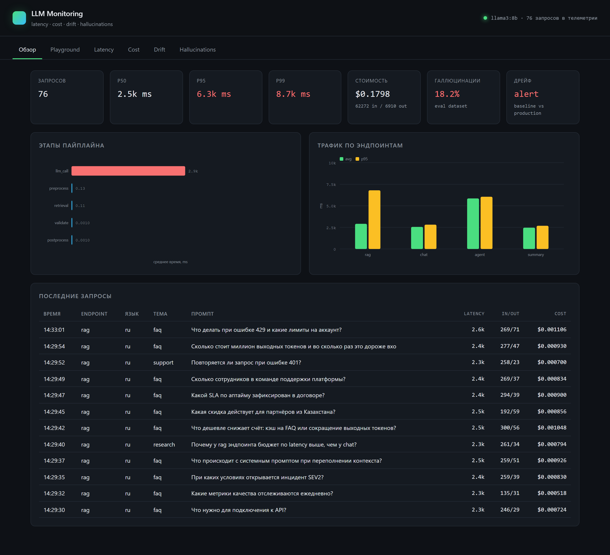
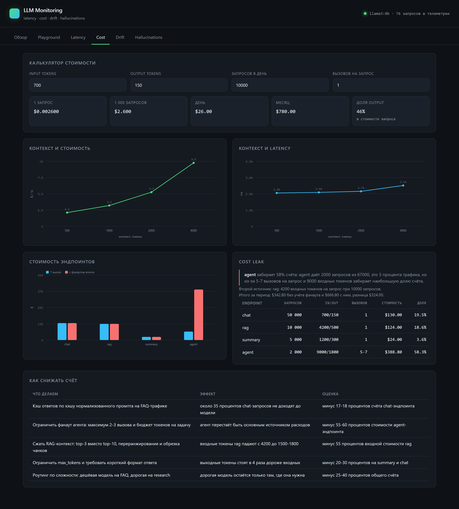

# LLM Monitoring

Локальный LLM-сервис с телеметрией и дашбордом, на котором разобраны четыре темы: latency, cost, drift и галлюцинации.

Модель крутится в Ollama на своей машине, каждый запрос проходит через пайплайн с замером этапов и попадает в SQLite. Поверх телеметрии считаются метрики, строятся графики и отдельные отчёты по каждому кейсу.

```
Client  ->  API (FastAPI)  ->  pipeline  ->  Ollama (llama3:8b)
                                  |
                                  v
                            SQLite telemetry
                                  |
              +---------+---------+---------+
              v         v         v         v
           latency    cost      drift   hallucinations
```



## Что внутри

- API-сервис на FastAPI с дашбордом в тёмной теме, без внешних JS-библиотек.
- Пайплайн запроса: валидация, препроцессинг, retrieval по локальной базе знаний, вызов модели, постобработка, запись телеметрии. Время каждого этапа пишется в базу.
- Телеметрия в SQLite: `request_id`, `timestamp`, `model`, `prompt`, `response`, `latency_ms`, `input_tokens`, `output_tokens`, `endpoint`, `language`, `topic`, стоимость и тайминги этапов. Выгрузка в CSV лежит в `reports/telemetry.csv`.
- Четыре скрипта, которые прогоняют кейсы и складывают результаты в `reports/` в виде JSON, CSV и PNG.
- Дашборд читает те же JSON, поэтому цифры в интерфейсе и в отчёте всегда совпадают.

## Запуск

Нужны Python 3.11+ и установленная Ollama.

```bash
ollama serve
ollama pull llama3:8b

pip install -r requirements.txt
```

Прогнать все кейсы и собрать отчёты:

```bash
python scripts/run_all.py
```

Поднять сервис с дашбордом:

```bash
uvicorn app.main:app --reload
```

Дашборд открывается на http://localhost:8000, вкладка Playground шлёт запрос в модель и показывает тайминги этапов.

Кейсы можно гонять по отдельности:

```bash
python scripts/run_latency.py            # 36 обычных запросов + 5 медленных
python scripts/run_cost.py               # эксперимент с контекстом 500/1000/2000/4000
python scripts/run_eval.py               # evaluation dataset из 22 вопросов
python scripts/run_drift.py              # baseline vs production, без вызовов модели
```

У скриптов latency и cost есть флаг `--recalc`: пересчитать метрики по уже собранной телеметрии, не дёргая модель.

## Настройки

| Переменная | По умолчанию | Что делает |
| --- | --- | --- |
| `OLLAMA_URL` | `http://localhost:11434` | адрес локального рантайма |
| `LLM_MON_MODEL` | `llama3:8b` | модель |
| `LLM_MON_DB` | `data/telemetry.db` | файл базы телеметрии |
| `LLM_MON_NUM_PREDICT` | `160` | лимит выходных токенов |
| `LLM_MON_NUM_CTX` | `8192` | размер контекстного окна |

Пороги алертов и цены лежат в `app/config.py`.

## Структура

```
app/
  main.py         API и раздача дашборда
  pipeline.py     обработка запроса с замером этапов
  llm.py          клиент Ollama
  storage.py      SQLite и выгрузка в CSV
  retrieval.py    поиск по базе знаний
  metrics.py      перцентили, гистограммы, разбивка по этапам
  pricing.py      стоимость запроса и эндпоинта
  drift.py        PSI, JS-дистанция, детектор дрейфа
  evaluation.py   разметка утверждений и галлюцинаций
  charts.py       тёмная тема для matplotlib
data/
  prompts.json          36 промптов для нагрузки
  eval_dataset.json     22 вопроса с эталонными ответами
  knowledge_base.json   12 документов для retrieval
  drift_profiles.json   распределения baseline и production
  endpoints.csv         трафик по эндпоинтам
scripts/
  run_latency.py  run_cost.py  run_drift.py  run_eval.py  run_all.py
reports/
  latency_metrics.json  cost_analysis.json  drift_report.json  eval_results.json
  telemetry.csv  eval_results.csv  charts/*.png
  REPORT.md       отчёт по четырём кейсам
web/
  index.html  style.css  app.js  charts.js
```

## API

| Метод | Путь | Что отдаёт |
| --- | --- | --- |
| POST | `/api/generate` | ответ модели, токены, стоимость, тайминги этапов |
| GET | `/api/telemetry` | последние запросы из базы |
| GET | `/api/overview` | сводка: перцентили, стоимость, языки, темы, статус дрейфа |
| GET | `/api/report/{latency\|cost\|drift\|eval}` | отчёт соответствующего кейса |
| GET | `/api/drift/live` | дрейф живого трафика относительно baseline |
| GET | `/api/health` | статус Ollama и число записей в телеметрии |

## Дашборд

Шесть вкладок: обзор, playground и по одной на каждый кейс. Графики нарисованы на чистом SVG, никаких CDN, поэтому дашборд работает без интернета.



## Результаты

Подробный разбор с графиками и выводами лежит в [reports/REPORT.md](reports/REPORT.md). Коротко:

- **Latency.** Вызов модели занимает больше 99 процентов времени запроса, всё остальное в пайплайне это единицы миллисекунд. Пять медленных запросов из сорока одного почти не двигают медиану, но заметно поднимают p99, поэтому алерт вешается на p95 и p99, а не на среднее.
- **Cost.** Стоимость линейно растёт с размером контекста, latency растёт заметно медленнее. Основной источник утечки денег это агент: три процента трафика и до 5-7 вызовов модели на один пользовательский запрос.
- **Drift.** Между baseline и production поехали и язык, и тема, и длина запроса. Сильнее всего изменилась длина запроса, по категориям PSI выше порога alert у темы и языка.
- **Hallucinations.** Evaluation pipeline режет ответ на утверждения и размечает каждое как SUPPORTED, PARTIALLY_SUPPORTED, UNSUPPORTED или CONTRADICTED. Отдельно считается доля отказов, чтобы не путать промах с выдумкой.

## Воспроизводимость

Все эксперименты идут локально: модель в Ollama, телеметрия в SQLite, графики в matplotlib. Сид генерации зафиксирован, температура 0.2, поэтому повторный прогон даёт близкие цифры. Абсолютные значения latency зависят от железа, соотношения между этапами и перцентилями сохраняются.
