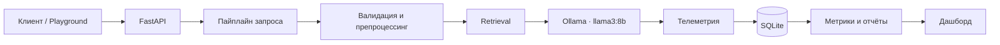

<div align="center">

# LLM Monitoring

### Локальный стенд для наблюдения за LLM: latency, стоимостью, drift и галлюцинациями

`Python 3.11+` &nbsp;·&nbsp; `FastAPI` &nbsp;·&nbsp; `Ollama` &nbsp;·&nbsp; `SQLite`

[Быстрый старт](#быстрый-старт) · [Что измеряется](#что-измеряется) · [Архитектура](#архитектура) · [Результаты](#результаты) · [API](#api)

</div>

<br />


<div align="center"><sup>20 секунд без звука — <a href="docs/brag.mp4">полная версия со звуком</a></sup></div>

> **Зачем это нужно:** один запрос к локальной модели превращается в измеряемый пайплайн. Стенд сохраняет телеметрию, считает метрики, показывает их на дашборде и помогает расследовать четыре типичных проблемы LLM-сервиса.

## Что измеряется

| Кейс               | Вопрос, на который отвечает стенд                        | Что можно увидеть                                                      |
| ------------------ | -------------------------------------------------------- | ---------------------------------------------------------------------- |
| **Latency**        | Где теряется время и почему среднее скрывает проблему?   | p50/p95/p99, разбивку по этапам и влияние медленных запросов           |
| **Cost**           | Какие сценарии создают счёт и как его сократить?         | токены, стоимость по endpoint, рост цены с контекстом и fan-out агента |
| **Drift**          | Почему продовое качество упало, хотя модель не менялась? | сдвиг языка, темы и длины запроса; PSI и JS-дистанцию                  |
| **Hallucinations** | Когда ответ не опирается на знания?                      | разметку утверждений, hallucination rate и качество retrieval          |

## Быстрый старт

**Нужно:** Python 3.11+ и установленная [Ollama](https://ollama.com/).

В первом терминале запустите Ollama и загрузите модель:

```bash
ollama serve
ollama pull llama3:8b
```

Во втором — подготовьте окружение и запустите сервис:

```bash
git clone https://github.com/VllSunday/llm-monitoring.git
cd llm-monitoring

python -m venv .venv
# Windows PowerShell: .\.venv\Scripts\Activate.ps1
# macOS / Linux:      source .venv/bin/activate

pip install -r requirements.txt
uvicorn app.main:app --reload
```

Откройте [http://localhost:8000](http://localhost:8000). Во вкладке **Playground** можно отправить запрос в модель и сразу увидеть время всех этапов, число токенов и стоимость.

### Собрать эксперименты заново

Репозиторий содержит готовые отчёты и графики. Чтобы получить результаты на своём железе, выполните полный прогон:

```bash
python scripts/run_all.py
```

Или запускайте конкретный кейс:

```bash
python scripts/run_latency.py   # 36 обычных запросов + 5 медленных
python scripts/run_cost.py      # контекст: 500 / 1000 / 2000 / 4000 токенов
python scripts/run_drift.py     # baseline vs. production, без вызова модели
python scripts/run_eval.py      # 22 вопроса из evaluation dataset
```

`run_latency.py` и `run_cost.py` поддерживают `--recalc`: метрики пересчитаются по уже собранной телеметрии без новых запросов к модели.

## Архитектура



Пайплайн замеряет `validate → preprocess → retrieval → llm_call → postprocess → persist`. Для каждого запроса в SQLite сохраняются `request_id`, timestamp, модель, промпт и ответ, latency, токены, endpoint, язык, тема, стоимость и тайминги этапов. Эту же базу читает дашборд, поэтому значения в интерфейсе совпадают с отчётами.

## Дашборд

Шесть вкладок: **Overview**, **Playground**, **Latency**, **Cost**, **Drift** и **Hallucinations**. Интерфейс работает без CDN: графики построены на чистом SVG, а оформление использует токены shadcn/ui.

Все шесть вкладок в работе видно в [ролике в начале README](#llm-monitoring).

## Результаты

Готовый прогон состоит из 75 запросов: 36 обычных, 5 намеренно медленных, 12 запросов в эксперименте с контекстом и 22 вопроса evaluation dataset.

| Наблюдение       | Результат                                                                         | Практический вывод                                                            |
| ---------------- | --------------------------------------------------------------------------------- | ----------------------------------------------------------------------------- |
| Хвост latency    | 5 медленных запросов подняли p99 на **43,9%**, а p50 — лишь на **1,1%**           | Алерты стоит строить по p95 и p99, а не по среднему                           |
| Источник времени | `llm_call` занимает **99,99%** времени пайплайна                                  | Оптимизировать нужно генерацию: лимиты токенов, кэш, стриминг и маршрутизацию |
| Стоимость        | Agent — **3%** трафика, но **58,3%** счёта из-за длинного контекста и 5–7 вызовов | Нужны лимит fan-out и бюджет токенов на задачу                                |
| Drift            | Длина запроса выросла на **181%**, PSI языка — **0,269**, темы — **0,314**        | Распределения входа нужно мониторить рядом с качеством                        |
| Галлюцинации     | На 22 вопросах hallucination rate — **18,2%**                                     | Качество ответа следует связывать с relevance retrieval и размером контекста  |

Полная методика, графики, пороги алертов и рекомендации находятся в [подробном отчёте](reports/REPORT.md).

## API

| Метод  | Путь                                       | Назначение                                                                    |
| ------ | ------------------------------------------ | ----------------------------------------------------------------------------- |
| `POST` | `/api/generate`                            | Выполнить запрос к модели и вернуть ответ с токенами, стоимостью и таймингами |
| `GET`  | `/api/overview`                            | Получить сводные latency-, cost- и drift-метрики                              |
| `GET`  | `/api/telemetry`                           | Получить последние сохранённые запросы                                        |
| `GET`  | `/api/report/{latency\|cost\|drift\|eval}` | Получить отчёт конкретного эксперимента                                       |
| `GET`  | `/api/drift/live`                          | Сравнить текущий трафик с baseline                                            |
| `GET`  | `/api/health`                              | Проверить доступность Ollama и число записей в телеметрии                     |

Пример запроса:

```bash
curl -X POST http://localhost:8000/api/generate \
  -H "Content-Type: application/json" \
  -d '{"prompt":"Как ограничить стоимость RAG-запросов?","endpoint":"rag"}'
```

## Настройка

| Переменная            | По умолчанию             | Описание                            |
| --------------------- | ------------------------ | ----------------------------------- |
| `OLLAMA_URL`          | `http://localhost:11434` | Адрес локального рантайма Ollama    |
| `LLM_MON_MODEL`       | `llama3:8b`              | Используемая модель                 |
| `LLM_MON_DB`          | `data/telemetry.db`      | Путь к SQLite-базе телеметрии       |
| `LLM_MON_NUM_PREDICT` | `160`                    | Лимит выходных токенов              |
| `LLM_MON_NUM_CTX`     | `8192`                   | Размер контекстного окна            |
| `LLM_MON_TIMEOUT`     | `300`                    | Таймаут запроса к Ollama в секундах |

Пороги latency/drift и условные цены заданы в [`app/config.py`](app/config.py).

## Структура проекта

```text
app/        API, pipeline, Ollama-клиент, метрики, drift и evaluation
data/       промпты, база знаний, baseline и evaluation dataset
scripts/    воспроизводимые прогоны четырёх экспериментов
reports/    JSON/CSV-результаты, графики и развёрнутый отчёт
web/        статический дашборд без внешних JS-библиотек
docs/       ролик с обзором интерфейса и скриншоты
```

## Воспроизводимость и ограничения

Все эксперименты выполняются локально: Ollama запускает модель, SQLite хранит телеметрию, matplotlib строит графики. У генерации зафиксированы `seed=42` и `temperature=0.2`, поэтому повторные прогоны должны давать близкие результаты. Абсолютное latency зависит от оборудования; сравнивать между прогонами корректнее перцентили, доли этапов и относительные изменения.

Метод оценки галлюцинаций — воспроизводимый baseline на основе сравнения утверждений с эталонным ответом. Он полезен для мониторинга и экспериментов, но в production стоит дополнять его LLM-судьёй или NLI-моделью.
