# Отчёт по мониторингу локального LLM-сервиса

Модель: llama3:8b в Ollama, температура 0.2, seed 42, контекстное окно 8192.
Сервис: FastAPI, телеметрия в SQLite, выгрузка в `telemetry.csv`.
В базе 75 запросов: 36 обычных, 5 намеренно тяжёлых, 12 на эксперимент с контекстом, 22 на evaluation dataset.
Суммарно 62003 входных и 6839 выходных токенов, по условным ценам задания это $0.1787.

Все цифры ниже собраны скриптами из `scripts/`, JSON лежит рядом в этой же папке, графики в `charts/`.

---

## CASE 1. Latency

### Как мерил

Каждый запрос проходит шесть этапов, время каждого пишется в телеметрию:

`validate` -> `preprocess` -> `retrieval` -> `llm_call` -> `postprocess` -> `persist`

Базовая выборка это 36 запросов по четырём эндпоинтам (chat, rag, summary, agent), файл `data/prompts.json`.
Отдельно прогнал 5 тяжёлых запросов: контекст 4500 токенов, лимит генерации 800 токенов.

### Метрики

| метрика | базовая выборка | с медленными запросами | изменение |
| --- | ---: | ---: | ---: |
| count | 36 | 41 | +5 |
| average | 2657.9 ms | 3192.1 ms | +20.1% |
| p50 | 2500.3 ms | 2527.7 ms | +1.1% |
| p95 | 5660.2 ms | 6796.2 ms | +20.1% |
| p99 | 6049.8 ms | 8708.6 ms | +43.9% |
| min | 2176.1 ms | 2176.1 ms | 0 |
| max | 6049.8 ms | 8708.6 ms | +43.9% |

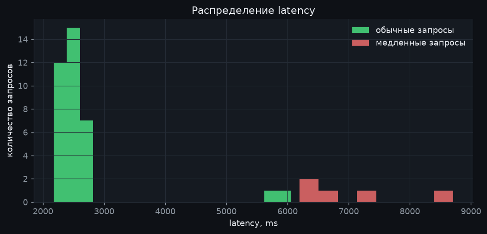

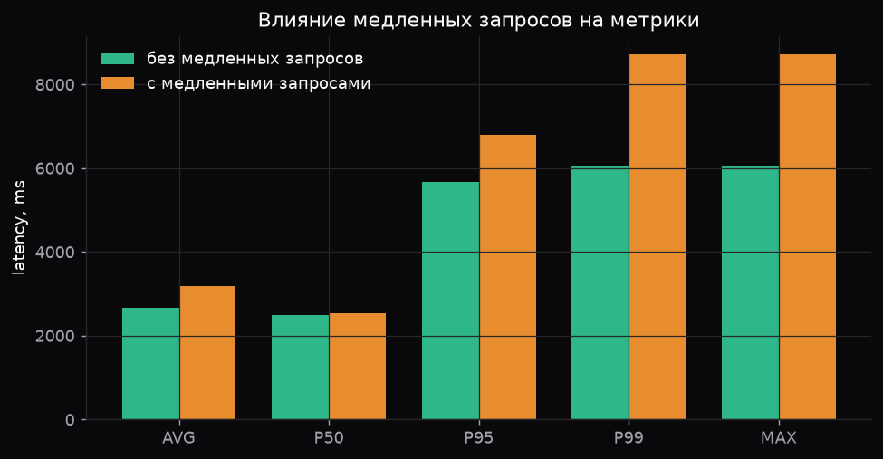

Распределение двугорбое: основная масса запросов лежит в диапазоне 2.2-2.9 секунды, отдельно стоит группа около 6 секунд. Это эндпоинт agent, который делает два вызова модели на один пользовательский запрос.

### Этапы пайплайна

| этап | среднее, ms | доля времени |
| --- | ---: | ---: |
| llm_call | 2657.8 | 99.99% |
| retrieval | 0.053 | 0.002% |
| preprocess | 0.038 | 0.001% |
| validate | 0.001 | 0.00004% |
| postprocess | 0.001 | 0.00004% |

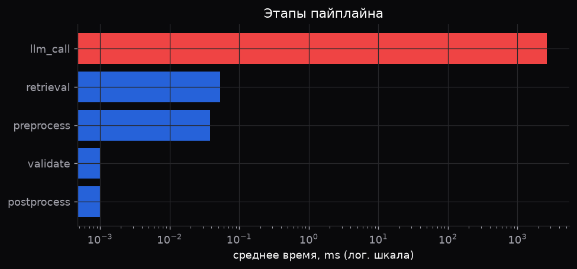

Самый медленный этап это вызов модели, на него уходит практически всё время запроса. Оптимизировать препроцессинг или локальный retrieval смысла нет, заметный выигрыш дадут только работа с самой генерацией: меньше выходных токенов, кэш, стриминг для восприятия, роутинг коротких запросов на модель поменьше.

По эндпоинтам:

| endpoint | запросов | average, ms | p95, ms |
| --- | ---: | ---: | ---: |
| chat | 19 | 2558.2 | 2817.5 |
| rag | 10 | 2303.1 | 2566.0 |
| summary | 5 | 2467.8 | 2685.3 |
| agent | 2 | 5855.0 | 6049.8 |

### Что это даёт для прода

Пять медленных запросов из 41, то есть 12 процентов трафика, почти не сдвинули медиану (+1.1%), но подняли p99 на 44 процента. Если смотреть только на среднее, такой инцидент виден слабо, а пользователи в хвосте уже ждут по 8-9 секунд.

Для продового мониторинга беру: p50, p95, p99, error rate, tokens per second и отдельно время llm_call. Среднее оставляю только как справочную величину.

Правило алерта:

```
p95 за скользящее окно 5 минут > 6000 ms в течение 10 минут
или p99 > 12000 ms в течение 5 минут
(окно считается при минимум 50 запросах, иначе метрика шумит)
```

На базовой выборке алерт молчит, на выборке с медленными запросами срабатывает по p95 (6796 ms против порога 6000 ms). Пороги взяты как примерно двукратный запас к текущему p95 базовой выборки.

### Вывод

Latency сервиса упирается в генерацию, а не в обвязку. Тяжёлые запросы бьют по хвосту распределения, поэтому алерты вешаю на перцентили и слежу за хвостом отдельно от медианы. Дополнительно стоит ограничивать число вызовов модели на один запрос, потому что agent сразу удваивает время ответа.

---

## CASE 2. Cost

Цены из задания: $2 за 1M входных токенов, $8 за 1M выходных. Для проекций беру 10000 запросов в день и 30 дней в месяце.

### Стоимость запроса

Измеренный rag-запрос: 818 входных токенов, 59 выходных.

| объём | стоимость |
| --- | ---: |
| 1 запрос | $0.002108 |
| 1 000 запросов | $2.11 |
| день (10k запросов) | $21.08 |
| месяц (300k запросов) | $632.40 |

Для типичного chat-запроса (700 вход, 150 выход) выходит $0.0026 за запрос и $780 в месяц. В измеренном запросе 78 процентов стоимости дал вход, но это следствие короткого ответа: выходной токен дороже входного в 4 раза, и на длинных ответах картина переворачивается.

### Эксперимент с размером контекста

Один и тот же вопрос, разный объём подмешанного контекста, по 3 прогона на точку.

| контекст | input tokens | output tokens | latency, ms | стоимость 1000 запросов |
| ---: | ---: | ---: | ---: | ---: |
| 500 | 818 | 58 | 2562 | $2.10 |
| 1000 | 1325 | 68 | 2608 | $3.19 |
| 2000 | 2349 | 69 | 2690 | $5.25 |
| 4000 | 4431 | 112 | 3138 | $9.76 |

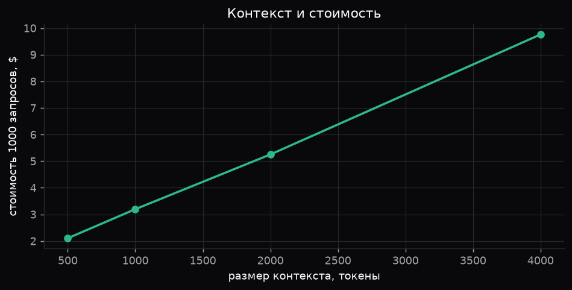

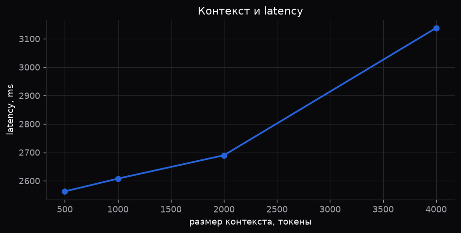

Стоимость растёт почти линейно с контекстом: рост входа в 5.4 раза дал рост цены в 4.6 раза. Latency при этом выросла всего на 22 процента, потому что prompt eval идёт пачкой, а основное время занимает генерация. Отсюда практический вывод: раздутый контекст сначала бьёт по счёту и только потом по скорости, и по графикам latency такую проблему не заметишь.

### Эндпоинты

| endpoint | запросов | avg input | avg output | вызовов на запрос | стоимость | доля |
| --- | ---: | ---: | ---: | ---: | ---: | ---: |
| chat | 50 000 | 700 | 150 | 1 | $130.00 | 19.5% |
| rag | 10 000 | 4 200 | 500 | 1 | $124.00 | 18.6% |
| summary | 5 000 | 1 200 | 300 | 1 | $24.00 | 3.6% |
| agent | 2 000 | 9 000 | 1 800 | 5-7 | $388.80 | 58.3% |

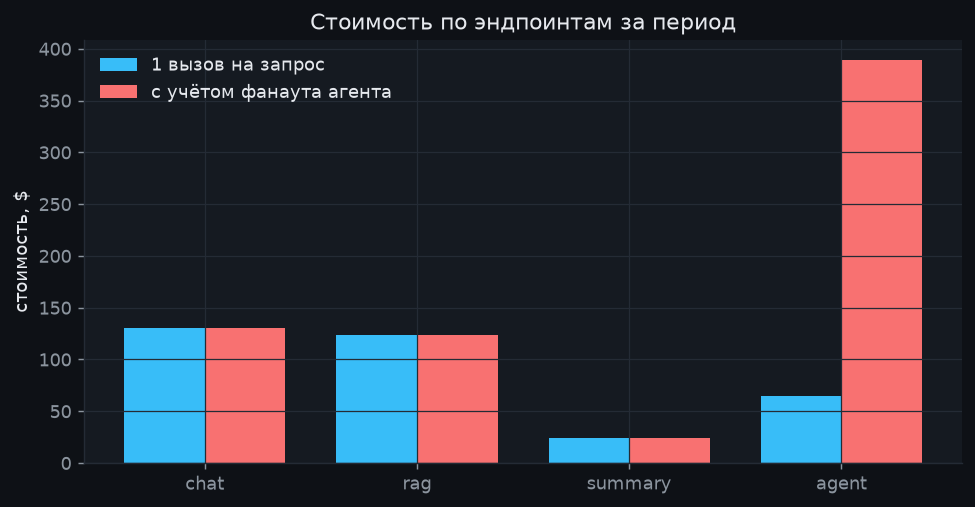

Без учёта фанаута счёт составляет $342.80 и выглядит так, будто основной потребитель это chat. С учётом 5-7 вызовов на один пользовательский запрос счёт вырастает до $666.80, и картина меняется полностью.

### Cost leak

Основной источник утечки это agent. Он даёт 2000 запросов из 67000, то есть 3 процента трафика, но забирает 58 процентов счёта. Причин две: 9000 входных токенов на вызов и до 7 вызовов на один пользовательский запрос. Диапазон 5-7 вызовов это разброс от $324 до $453 в месяц только по одному эндпоинту, то есть неопределённость больше, чем весь бюджет summary.

Второй по значимости источник это rag: 4200 входных токенов на запрос при 10000 запросов.

### Что делать

1. Кэш ответов по хэшу нормализованного промпта на FAQ-трафике. Около 35 процентов chat-запросов не доходят до модели, это минус 17-18 процентов счёта chat.
2. Ограничить фанаут агента: жёсткий лимит 2-3 вызова и бюджет токенов на задачу. Минус 55-60 процентов стоимости agent, то есть больше $200 в месяц.
3. Сжать RAG-контекст: top-3 вместо top-10, переранжирование и обрезка чанков. Вход падает с 4200 до 1500-1800 токенов, минус примерно 55 процентов входной стоимости rag.
4. Ограничить max_tokens и требовать короткий формат ответа, потому что выходной токен в 4 раза дороже входного.
5. Роутинг по сложности: FAQ на дешёвую модель, research на дорогую.

### Вывод

Считать стоимость по среднему запросу бесполезно, деньги живут в хвосте: один эндпоинт с фанаутом перевешивает весь остальной трафик. В мониторинге нужны не только токены на запрос, но и число вызовов модели на один пользовательский запрос, иначе рост счёта не объяснить.

---

## CASE 3. Drift

### Baseline против production

| признак | baseline | production | изменение |
| --- | --- | --- | --- |
| язык EN | 70% | 45% | -25 п.п. |
| язык RU | 20% | 40% | +20 п.п. |
| язык KZ | 10% | 15% | +5 п.п. |
| тема FAQ | 45% | 20% | -25 п.п. |
| тема Support | 30% | 50% | +20 п.п. |
| тема Research | 25% | 30% | +5 п.п. |
| длина запроса | 42 токена | 118 токенов | +181% |

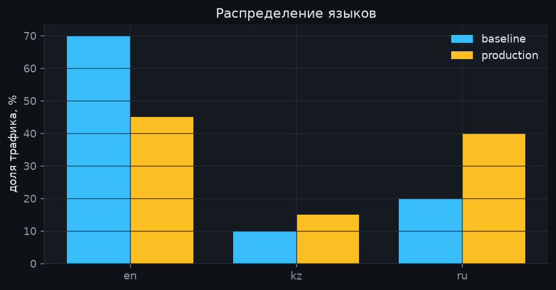

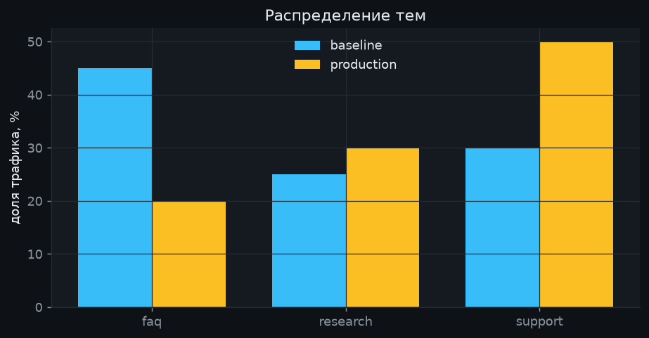

### Детектор

Считаю три метрики: PSI, дистанцию Дженсена-Шеннона и total variation. Для числовых признаков смотрю относительное изменение среднего.

| признак | метрика | значение | статус |
| --- | --- | ---: | --- |
| query_length_tokens | относительное изменение | +181.0% | alert |
| topic | PSI | 0.314 | alert |
| language | PSI | 0.269 | alert |

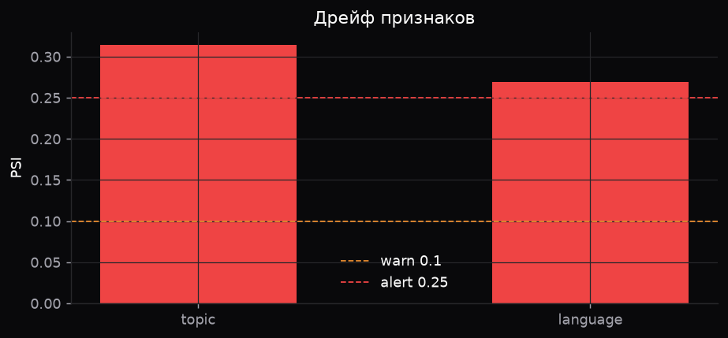

Пороги:

- PSI < 0.1 это норма;
- PSI от 0.1 до 0.25 это warn, завожу тикет и смотрю разбивку по сегментам;
- PSI от 0.25 это alert, нужен прогон обновлённого golden dataset;
- для длины запроса warn при изменении среднего на 30 процентов, alert при 60;
- окно 24 часа против baseline за 30 дней, PSI не считаю на выборке меньше 200 запросов.

Детектор проверил на синтетических выборках по 2000 наблюдений из тех же распределений: PSI по языку получился 0.295 против 0.269 на чистых долях, то есть на реальных объёмах метрика устойчива.

Заодно прогнал детектор по собственной телеметрии проекта: там PSI по языку 2.59, потому что мои тестовые промпты почти все на русском, а baseline из задания это 70 процентов английского. Хороший пример того, что baseline нужно брать из своего же трафика, а не из соседнего сервиса.

Сильнее всего изменилась длина запроса. Она бьёт сразу по двум вещам: контекст растёт, значит растёт счёт, и поисковый запрос размывается, значит падает качество retrieval.

### Инцидент: прод 91 -> 82, golden 91 -> 90

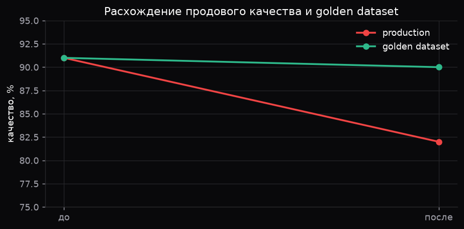

Golden dataset почти не изменился, значит модель на старых данных отвечает как раньше. Проблема либо в новом трафике, либо в том, что вокруг модели.

**Гипотеза 1. Сменился состав трафика, golden его не покрывает.**
Support вырос с 30 до 50 процентов, RU с 20 до 40, длина запроса выросла в 2.8 раза. Что проверить: качество в разрезе language и topic, PSI по дням, долю запросов без похожего примера в golden, покрытие golden по сегментам. Подтвердится, если падение сосредоточено в RU и support, а в EN и FAQ качество прежнее.

**Гипотеза 2. Деградировал retrieval на длинных запросах.**
Что проверить: relevance и recall@k по сегментам, средний score top-1, долю запросов без релевантного чанка, корреляцию длины запроса и оценки. Подтвердится, если relevance падает вместе с ростом длины запроса.

**Гипотеза 3. Контекст переполняется и обрезается.**
Что проверить: долю запросов с truncation, распределение input_tokens по перцентилям, долю ответов вида нет данных. Подтвердится, если доля truncation выросла синхронно с падением качества.

**Гипотеза 4. Изменился способ измерения качества в проде.**
Golden считается автоматически, продовая оценка зависит от выборки и разметчиков. Что проверить: состав выборки, долю новых разметчиков, согласованность оценок, версию промпта LLM-судьи. Подтвердится, если переразметка старой выборки новым процессом тоже даёт падение.

**Гипотеза 5. Изменилось окружение инференса.**
Модель формально та же, но могли поменяться квантование, версия рантайма или пул инстансов. Что проверить: версию рантайма и хэш весов, качество по инстансам и зонам, tokens per second по пулам. Подтвердится, если проседает только часть инстансов.

Порядок проверки: сначала разложить продовое качество по сегментам, потом сравнить retrieval-метрики в тех же сегментах, потом найти по PSI день, когда началось расхождение, и только после этого трогать модель.

### Вывод

Расхождение продового качества и golden dataset это почти всегда сигнал про данные, а не про модель. Поэтому в мониторинге держу распределения входа (язык, тема, длина) рядом с метриками качества, и golden dataset обновляю вслед за трафиком, иначе он перестаёт что-либо ловить.

---

## CASE 4. Hallucinations

### Как устроен evaluation pipeline

Dataset из 22 вопросов с эталонными ответами лежит в `data/eval_dataset.json`, типы вопросов: factual, numeric, procedural, comparison, out_of_scope. Вопросы вне базы знаний попадают в отдельный тип, правильный ответ на них это признать, что данных нет.

Каждый вопрос идёт через rag-эндпоинт, ответ режется на отдельные утверждения по предложениям и пунктам списка. Каждое утверждение сравнивается с эталоном по доле значимых слов:

- от 0.6 это SUPPORTED;
- от 0.3 это PARTIALLY_SUPPORTED;
- ниже это UNSUPPORTED;
- расхождение чисел или отрицание, которого нет в эталоне, это CONTRADICTED.

Галлюцинацией считаю ответ, где есть CONTRADICTED, либо половина утверждений не подтверждена, либо score ниже 0.4. Отдельно считаю отказы: если модель говорит, что данных нет, это либо правильное поведение (вопрос вне базы), либо промах (ответ в базе был), но не выдумка.

### Результаты

| метрика | значение |
| --- | ---: |
| вопросов | 22 |
| hallucination rate | 18.2% |
| abstain rate | 13.6% |
| средний score | 0.659 |
| accuracy@0.6 | 54.5% |

Разметка утверждений: 27 штук всего.

| метка | штук | доля |
| --- | ---: | ---: |
| SUPPORTED | 14 | 51.9% |
| PARTIALLY_SUPPORTED | 7 | 25.9% |
| UNSUPPORTED | 5 | 18.5% |
| CONTRADICTED | 1 | 3.7% |

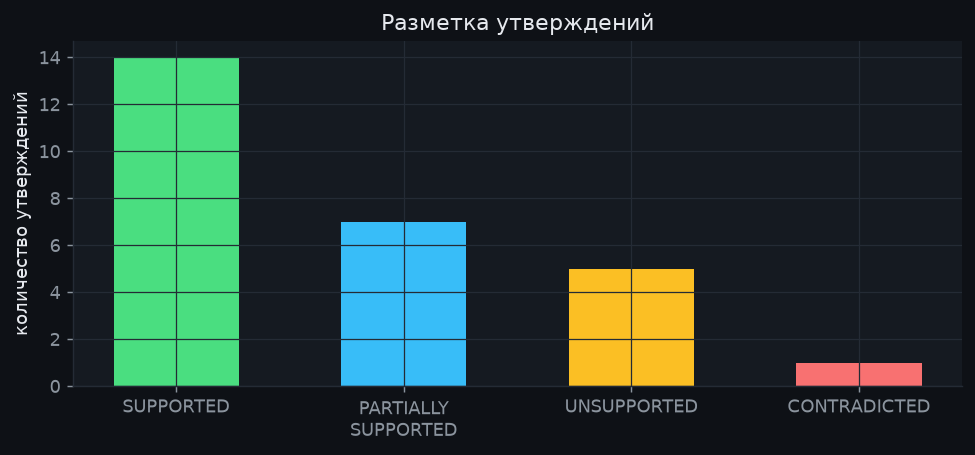

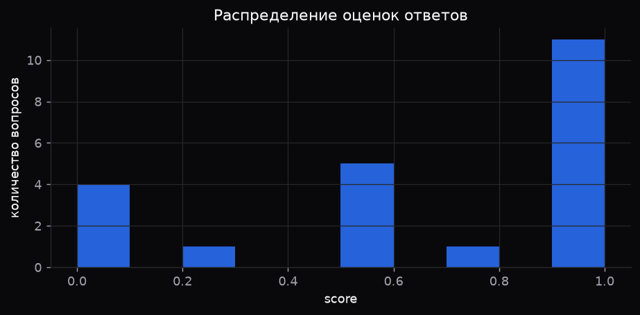

### Какие вопросы ломают модель

| тип вопроса | вопросов | hallucination rate | средний score |
| --- | ---: | ---: | ---: |
| comparison | 2 | 50.0% | 0.25 |
| out_of_scope | 3 | 33.3% | 0.667 |
| factual | 7 | 14.3% | 0.643 |
| numeric | 8 | 12.5% | 0.688 |
| procedural | 2 | 0% | 1.0 |

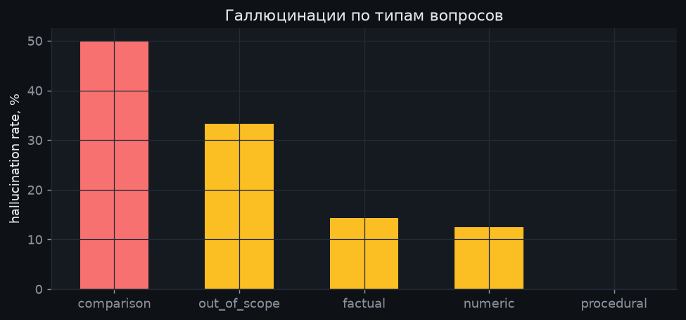

Хуже всего идут вопросы, где нужно сопоставить два факта из разных документов и сделать вывод: модель уверенно достраивает недостающее звено. Второй проблемный тип это вопросы вне базы знаний: вместо признания, что данных нет, модель выдаёт правдоподобный ответ. Простые фактические и числовые вопросы, где ответ лежит в одном чанке, отрабатывают нормально.

Ограничение метода: сравнение идёт по пересечению слов, поэтому перефразирование занижает оценку, а удачно подобранные слова могут её завысить. На проде поверх такого правила нужен LLM-судья или NLI-модель, но как быстрый и полностью воспроизводимый baseline правило работает.

### Что мониторить в проде

- hallucination rate на сэмпле продового трафика;
- grounding rate, то есть долю утверждений, подтверждённых контекстом;
- retrieval relevance, recall@k, долю запросов без релевантного чанка;
- долю ответов вида нет данных и долю пустых ответов;
- долю ответов, где есть числа, которых нет в контексте;
- обратную связь пользователей и жалобы на ответ.

### Инцидент: hallucination 3% -> 9%

Дано: retrieval relevance 86% -> 59%, контекст 1.2k -> 4.5k токенов, модель и промпт не менялись.

```
Change            контекст вырос с 1.2k до 4.5k токенов
  -> Symptom      hallucination rate втрое выше, relevance ниже на 27 пунктов
  -> Hypothesis   выросли top-k или размер чанка, в контекст попал шум
  -> Metric       top-k и размер чанка в конфиге, средний score top-1,
                  позиция релевантного чанка, recall@k, доля truncation
  -> Root cause   retriever отдаёт больше документов при той же точности,
                  релевантный фрагмент тонет среди нерелевантных
  -> Mitigation   вернуть top-k, добавить переранжирование и порог по score,
                  обрезать чанки, вернуть цитирование источника
```

Модель и промпт не менялись, значит искать нужно в том, что подаётся на вход. Рост контекста почти в 4 раза при одновременном падении relevance это прямой признак, что в промпт поехал мусор. Вторая ветка расследования это переиндексация: смена эмбеддера или чанкинга даёт ровно такую картину, поэтому проверяю версию индекса и дату переиндексации.

Мониторинг, который поймал бы это раньше:

- hallucination rate по скользящему окну 1 час, алерт выше 5 процентов;
- retrieval relevance и recall@k, алерт при падении ниже 75 процентов;
- средний и p95 context_size, алерт при росте более чем на 50 процентов к baseline;
- доля ответов без ссылки на источник;
- ежедневный прогон golden dataset и canary после каждой выкатки индекса;
- связка алертов: рост context_size вместе с падением relevance открывает инцидент сразу, не дожидаясь жалоб.

### Вывод

Галлюцинации редко появляются сами по себе, обычно это следствие того, что модель получила плохой контекст. Поэтому в мониторинге качества держу метрики retrieval рядом с метриками ответа и слежу за размером контекста как за ранним индикатором: он меняется первым, ещё до того, как поедет качество.

---

## Итог

Четыре кейса собираются в одну картину.

1. Latency упирается в генерацию, поэтому алерты на перцентилях, а не на среднем, и отдельный контроль числа вызовов модели на запрос.
2. Cost зависит не от объёма трафика, а от структуры: один эндпоинт с фанаутом и длинным контекстом даёт больше половины счёта.
3. Drift во входных данных объясняет падение качества там, где модель и промпт не менялись, поэтому распределения входа это тоже метрика продакшена.
4. Галлюцинации это чаще всего производная от retrieval, и ловить их надо связкой метрик, а не одним числом.

Общее для всех четырёх: число само по себе ничего не значит, пока рядом нет разбивки по сегментам и baseline, с которым его сравнивают.
